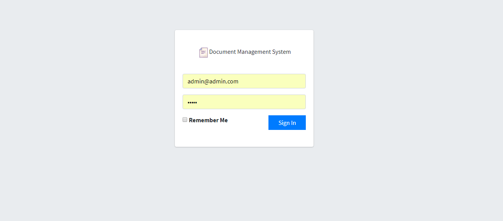
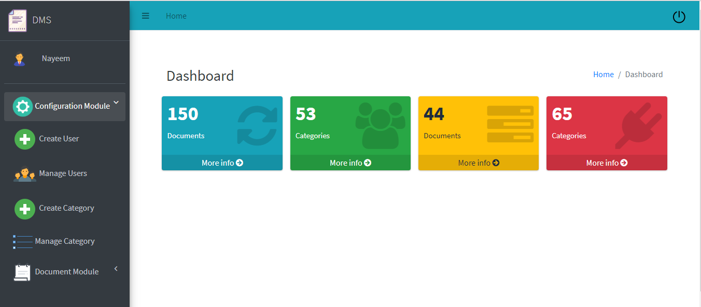
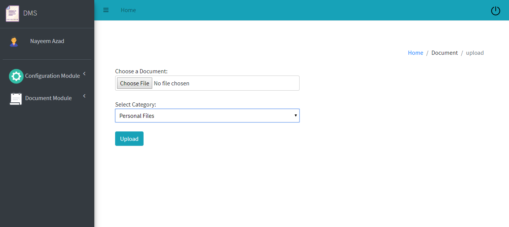
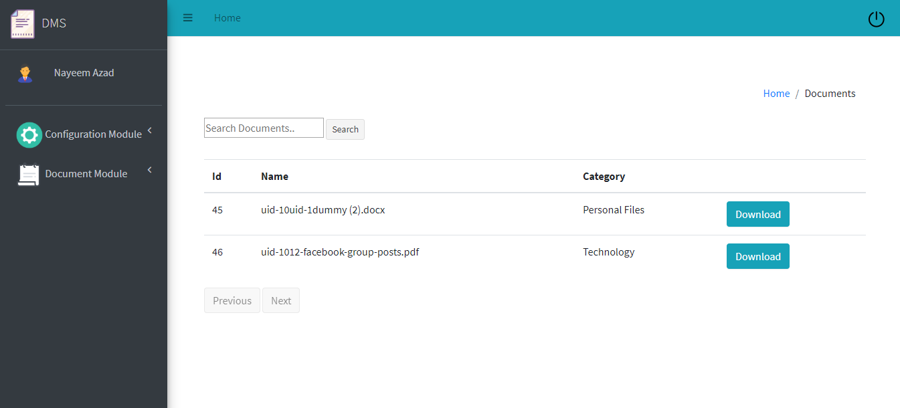

## DMS -Document Management System

## Technologies
C# ASP.NET core 2.1 (MVC ) , 3-tier Architechture, EF Code First

## Features
<ul>
	<li>Admin Creates Users & assign Roles</li>
	<li>User get notified by email for credentials</li>
	<li>User can creates own categories</li>
	<li>User can upload own documents</li>
	<li>User can Search & Downloads</li>
</ul>

## Screenshots

## Installation
step 1: $ git clone https://github.com/nayeemazad/DMS.git  
Step 2: Set gmail credential for sending mail at DMS.WebUI/appsettings.json file 
<pre>
"SendMail": {
    "Setting": {
      "Gmail": "your_gmail_id@gmail.com",
      "Password": "your_gmail_password",
    }
  }
</pre>
 
Step 3: Set ConnectionStrings for Database connection  
<pre>"ConnectionStrings": {
    "DmsDb": "Server=your_server_name;Initial Catalog=your_database_name;Integrated Security=True;User Id=user_id;Password=password;"
  }</pre>  

Step 4: Go to Package manager console and then run command <pre> PM> Update-Database</pre> . This will create database as specified in the ConnectionStrings and will execute the migration files. 

Step 5: Now insert an entry for admin at user table from database sql interface
<pre>
USE [DMS]
GO

INSERT INTO [dbo].[Users]
           ([UserEmail]
           ,[UserName]
           ,[password]
           ,[UserRole])
     	VALUES
           ('admin@admin.com',
            'Admin',
            'admin',
            'Admin')
GO
</pre> 
Final Step: Run your project and it will navigate to browser http://localhost:{port} 